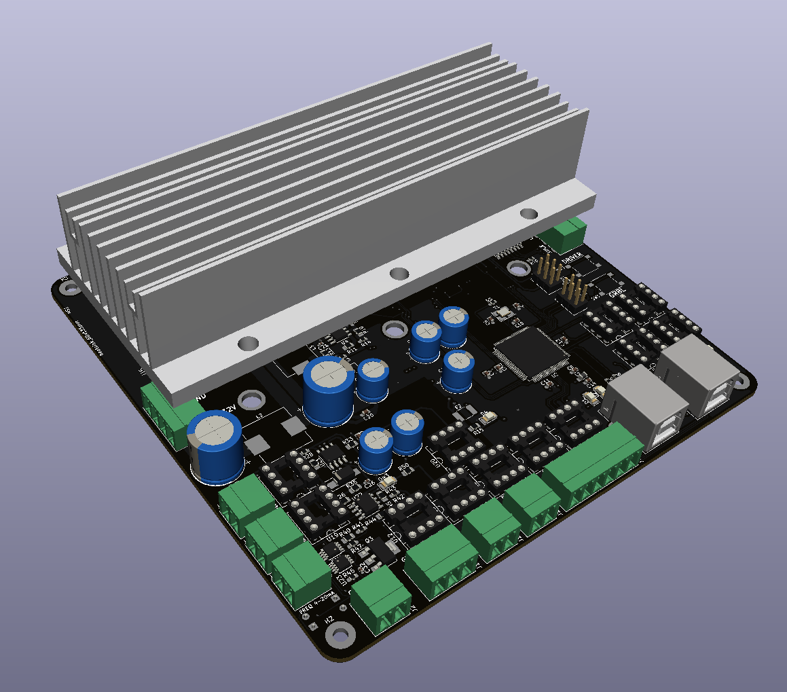
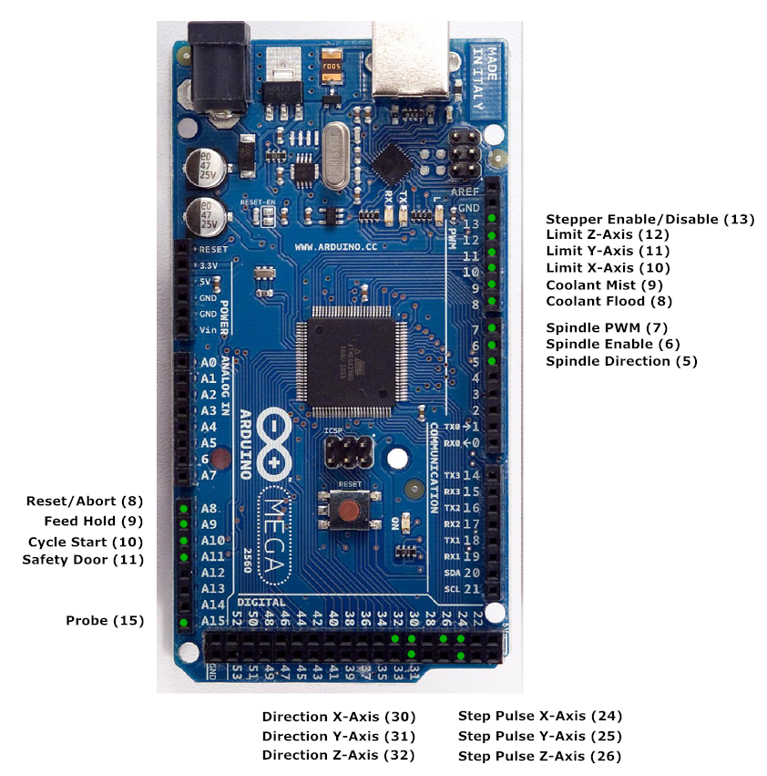

# GRBL_board

## Introduction

This is a PCB designed to run [GRBL](https://github.com/gnea/grbl), an open source CNC control software that is designed and optimised for Arduino. This board uses [GRBL-Mega](https://github.com/gnea/grbl-Mega), which is a version of GRBL that can run on the ATMEGA-2560, used in the Arduino Mega. This implementation allows GRBL to have a larger buffer size, since the ATMEGA-328P that GRBL was originally designed for has severe memory limitations.

This board design incorporates several additional features, such as:

- Designed for SPI configured Trinamic stepper drivers such as the TMC5160, TMC2130, etc.
- Ability to change the mirrored axis (X, Y or Z) via software (supports software configurable gantry levelling)
- All inputs and limit switch inputs wired with optocouplers, designed for normally open switches
- Onboard 12V 2A regulator, accepting 20-32VDC input
- Speed control for industrial VFDs, with a standard 4-20mA current loop for spindle speed control
- Sink logic for spindle control
- Possible sensorless homing using Trinamic drivers (not ideal since it only emulates a limit switch)

The goal is to accomplish this with minimal editing of the GRBL code, thus to do so an additional ATMEGA-328P is added on the board to enable the additional features.

## Connections

This board is designed with the aim of being as compatible as possible with the default GRBL, and as such, the pins are wired to follow the default GRBL-Mega pinout, as shown.

## Trinamic Drivers

Trinamic stepper motor drivers are exceptional in terms of performance and efficiency, incorporating advanced features that enable steppers to run cooler and with near silent operation. 

However, the tricky bit is that they are not a plug an play solution unlike other stepper drivers like the DRV8825 or the A4988 drivers. The drivers haveto be configured whenever they are powered up. To accomplish this, the separate ATMEGA-328P is used to communicate with the drivers via SPI in order to configure them.

## Mirrored Axis

Most CNC configurations include one axis which has dual stepper drive. GRBL has limited support for axis mirroring, and usually sacrifices some pins, such as spindle speed control. Thus, via the use of multiplexer ICs and the separate ATMEGA-328P, code can be uploaded to the ATMEGA-328P in order to specify which axis to mirror and whether to do gantry levelling for that axis.

To accomplish gantry levelling, the ATMEGA-328P will check the two limit switches on the mirrored axis, and if only one switch is triggered, the corresponding stepper's STEP pin will be held low, preventing it from moving until both switches are triggered. Once both limit switches are triggered, the limit switch signal will be sent to the GRBL controller running on the ATMEGA-2560.

## Inputs

Previously, I had an extremely bad experience with EMI on the limit switch lines when building a CNC, thus I decided to include an optocoupler on each input of the CNC controller. Although the switches are still normally open, the optocoupler requires current to drive the LED and thus it is nearly impossible for EMI to trigger the optocoupler. This should make the CNC much more robust against EMI, and it is possible to change the switches to normally closed by modifying GRBL.